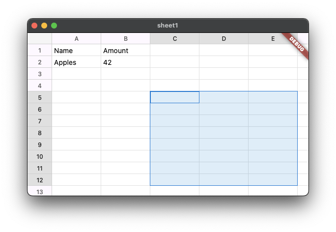

# Worksheet Widget

[](https://pub.dev/packages/worksheet)
[](https://opensource.org/licenses/MIT)
[](https://github.com/sjhorn/worksheet/actions/workflows/tests.yml)
[](https://codecov.io/gh/sjhorn/worksheet)

A Flutter widget that brings Excel-like spreadsheet functionality to your app.



Display and edit tabular data with smooth scrolling, pinch-to-zoom, and cell selection - all running at 60fps even with hundreds of thousands of rows.

## Try It In 30 Seconds

```dart
import 'package:flutter/material.dart';
import 'package:worksheet/worksheet.dart';

void main() => runApp(MaterialApp(home: MySpreadsheet()));

class MySpreadsheet extends StatelessWidget {
  @override
  Widget build(BuildContext context) {
    final data = SparseWorksheetData(rowCount: 100, columnCount: 10, cells: {
        (0, 0): 'Name'.cell,
        (0, 1): 'Amount'.cell,
        (1, 0): 'Apples'.cell,
        (1, 1): 42.cell,
        (2, 1): '=2+42'.formula,
        (3, 1): Cell.text('test'),
    });

    return Scaffold(
      body: WorksheetTheme(
        data: const WorksheetThemeData(),
        child: Worksheet(
          data: data,
          rowCount: 100,
          columnCount: 10,
        ),
      ),
    );
  }
}
```

That's it! You now have a scrollable, zoomable spreadsheet with row/column headers.

## Add Selection and Editing

Want users to select and edit cells? Add a controller and callbacks:

```dart
class EditableSpreadsheet extends StatefulWidget {
  @override
  State<EditableSpreadsheet> createState() => _EditableSpreadsheetState();
}

class _EditableSpreadsheetState extends State<EditableSpreadsheet> {
  final _data = SparseWorksheetData(rowCount: 1000, columnCount: 26);
  final _controller = WorksheetController();

  @override
  Widget build(BuildContext context) {
    return Scaffold(
      body: WorksheetTheme(
        data: const WorksheetThemeData(),
        child: Worksheet(
          data: _data,
          controller: _controller,
          rowCount: 1000,
          columnCount: 26,
          onCellTap: (cell) {
            print('Tapped ${cell.toNotation()}');  // "A1", "B5", etc.
          },
          onEditCell: (cell) {
            // Double-tap triggers edit - implement your editor UI
            print('Edit ${cell.toNotation()}');
          },
        ),
      ),
    );
  }

  @override
  void dispose() {
    _controller.dispose();
    _data.dispose();
    super.dispose();
  }
}
```

Now you can:
- Click cells to select them
- Use arrow keys to navigate
- Track selection via `_controller.selectedRange`
- Zoom with pinch gestures or `_controller.setZoom(1.5)`

## Format Your Numbers

Display values as currency, percentages, dates, and more using Excel-style format codes:

```dart
final data = SparseWorksheetData(rowCount: 100, columnCount: 10, cells: {
    (0, 0): 'Revenue'.cell,
    (0, 1): Cell.number(1234.56, format: CellFormat.currency),     // "$1,234.56"
    (1, 0): 'Growth'.cell,
    (1, 1): Cell.number(0.085, format: CellFormat.percentage),     // "9%"
    (2, 0): 'Date'.cell,
    (2, 1): Cell.date(DateTime(2024, 1, 15), format: CellFormat.dateIso), // "2024-01-15"
    (3, 0): 'Precision'.cell,
    (3, 1): Cell.number(3.14159, format: CellFormat.scientific),   // "3.14E+00"
    (4, 0): 'Duration'.cell,
    (4, 1): Cell.duration(Duration(hours: 1, minutes: 30), format: CellFormat.duration), // "1:30:00"
});
```

27 built-in presets cover common formats. For custom codes, create your own:

```dart
const custom = CellFormat(type: CellFormatType.number, formatCode: '#,##0.000');
```

Format with locale-aware separators and currency symbols:

```dart
// German locale: period for thousands, comma for decimals
final result = CellFormat.currency.formatRich(
  CellValue.number(1234.56),
  locale: FormatLocale.deDe,
);
// result.text == "1.234,56 €"
```

## Automatic Type & Format Detection

Type values into cells and they're stored as the right type with the right display format — not plain text:

```dart
// These are detected automatically during editing and paste:
// "2025-01-15"      → CellValue.date(DateTime(2025, 1, 15))    format: dateIso
// "Jan 15, 2025"    → CellValue.date(DateTime(2025, 1, 15))    format: dateShortLong
// "$1,234.56"       → CellValue.number(1234.56)                format: currency
// "42%"             → CellValue.number(0.42)                   format: percentage
// "1,234"           → CellValue.number(1234)                   format: integer
// "1:30:05"         → CellValue.duration(Duration(h:1,m:30,s:5)) format: duration
// "42"              → CellValue.number(42)                     (no format — plain number)

// Configure date format preferences for ambiguous dates:
Worksheet(
  data: data,
  dateParser: AnyDate.fromLocale('en-US'),  // month/day/year
)
```

`AnyDate` and `DateParserInfo` are re-exported from `package:worksheet/worksheet.dart`.

### Preserving the Format You Typed

When you type a value like `$1,234.56`, `42%`, `1/15/2024`, or `1:30:05`, the cell displays it in the format you typed — not as a raw number or ISO date. The widget auto-detects the format and stores it as a `CellFormat`:

```dart
// Configure locale for currency symbols and ambiguous dates (e.g., 01/02/2024)
Worksheet(
  data: data,
  formatLocale: FormatLocale.enUs,  // US: $ currency, month/day/year (default)
  // formatLocale: FormatLocale.enGb,  // UK: £ currency, day/month/year
  // formatLocale: FormatLocale.deDe,  // DE: € currency, comma decimals
)
```

Supports dates (ISO, US, EU, named months), currencies (locale-aware symbols), percentages, thousands-separated numbers, and durations (`H:mm:ss`, `H:mm`).

## Rich Text and Cell Merging

Style individual words within a cell and merge cells into regions:

```dart
final data = SparseWorksheetData(rowCount: 100, columnCount: 10, cells: {
    // Rich text: inline bold + colored text in one cell
    (0, 0): Cell.text('Total Revenue', richText: const [
      TextSpan(text: 'Total ', style: TextStyle(fontWeight: FontWeight.bold)),
      TextSpan(text: 'Revenue', style: TextStyle(color: Color(0xFF4472C4))),
    ]),
    // Multi-line text with word wrap
    (1, 0): Cell.text('Line 1\nLine 2',
        style: const CellStyle(wrapText: true)),
});

// Merge cells A1:D1 into a single wide cell
data.mergeCells(CellRange(0, 0, 0, 3));
```

Inline editing supports Ctrl+B/I/U for formatting and Alt+Enter for newlines in wrap-enabled cells. When building an external toolbar, call `editController.requestEditorFocus()` after each action to keep focus in the editor (see [Cookbook: Formatting Toolbar](docs/COOKBOOK.md#formatting-toolbar-with-editcontroller)).

## Style Your Data

Add colors, bold text, and conditional formatting:

```dart
// Header row styling
const headerStyle = CellStyle(
  backgroundColor: Color(0xFF4472C4),
  textColor: Color(0xFFFFFFFF),
  fontWeight: FontWeight.bold,
  textAlignment: CellTextAlignment.center,
);

// Apply to cells
_data.setStyle(const CellCoordinate(0, 0), headerStyle);
_data.setStyle(const CellCoordinate(0, 1), headerStyle);

// Add borders with line styles (solid, dashed, dotted, double)
_data.setStyle(
  const CellCoordinate(0, 0),
  const CellStyle(
    borders: CellBorders(
      bottom: BorderStyle(width: 2.0, lineStyle: BorderLineStyle.solid),
    ),
  ),
);

// Highlight negative numbers in red
final value = _data.getCell(CellCoordinate(row, col));
if (value != null && value.isNumber && value.asDouble < 0) {
  _data.setStyle(
    CellCoordinate(row, col),
    const CellStyle(textColor: Color(0xFFCC0000)),
  );
}
```

## Handle Large Datasets

The widget uses sparse storage and tile-based rendering, so this works smoothly:

```dart
// Excel-sized grid: 1 million rows, 16K columns
final data = SparseWorksheetData(
  rowCount: 1048576,
  columnCount: 16384,
);

// Only populated cells use memory
for (var row = 0; row < 50000; row++) {
  data[(row, 0)] = Cell.text('Row ${row + 1}');
}
// Memory usage: ~50K cells, not 17 billion empty cells
```

---

## Why This Widget?

### Built for Performance

- **Tile-based rendering**: Only visible cells are drawn, cached as GPU textures
- **60fps scrolling**: Smooth even with 100K+ populated cells
- **10%-400% zoom**: Pinch to zoom with automatic level-of-detail
- **O(log n) lookups**: Binary search for row/column positions

### Built for Real Apps

- **Sparse storage**: Memory scales with data, not grid size
- **Full selection**: Single cell, ranges, entire rows/columns
- **Cell merging**: Merge ranges into single cells with merge-aware rendering
- **Rich text**: Inline bold, italic, underline, color within a single cell
- **Multi-line text**: Word wrap with `wrapText` style, Alt+Enter for newlines
- **Keyboard navigation**: Arrow keys, Tab, Enter, Home/End, clipboard, and more — fully customizable via Flutter's Shortcuts/Actions
- **Automatic type detection**: Numbers, booleans, dates, and formulas detected from text input via `CellValue.parse()`
- **Formula cell referencing**: Click cells to insert A1 references, drag for ranges, arrow keys to insert/move refs, F4 for absolute/relative cycling, color-coded borders with marching ants
- **Formula autocomplete**: Dropdown suggestions for function names while typing formulas, with keyboard navigation and customizable function list
- **Resize support**: Drag column/row borders to resize
- **Mobile support**: Touch gestures, selection handles, pinch-to-zoom, configurable via `mobileMode`
- **Theming**: Full control over colors, fonts, headers — built-in light and dark mode presets

### Built with Quality

- **SOLID principles**: Clean separation of concerns
- **Test coverage**: 87%+ with unit, widget, and performance tests
- **TDD workflow**: Tests written before implementation

---

## Documentation

| Guide | Description |
|-------|-------------|
| [Getting Started](docs/GETTING_STARTED.md) | Installation, basic setup, enabling editing |
| [Cookbook](docs/COOKBOOK.md) | Practical recipes for common tasks |
| [Performance](docs/PERFORMANCE.md) | Tile cache tuning, large dataset strategies |
| [Theming](docs/THEMING.md) | Colors, fonts, headers, selection styles |
| [Testing](docs/TESTING.md) | Unit tests, widget tests, benchmarks |
| [API Reference](docs/API.md) | Quick reference for all classes and methods |
| [Architecture](docs/ARCHITECTURE.md) | Deep dive into the rendering pipeline |
| [Mobile Interaction](docs/MOBILE_INTERACTION.md) | Touch gestures, selection handles, mobile mode |
| [Mouse Cursors](docs/MOUSE_CURSOR.md) | Desktop cursor behavior and hit zones |
| [Cell Merging Reference](docs/CELL_MERGING.md) | Merge types, data rules, restrictions |
| [Cell Spillover](docs/CELL_SPILLOVER.md) | Text overflow into adjacent empty cells |
| [Cell Referencing](docs/CELL_REFERENCING.md) | Formula cell reference editing behavior |
| [Formula Autocomplete](docs/AUTOCOMPLETE.md) | Function name autocomplete dropdown spec |

---

## Installation

Add to your `pubspec.yaml`:

```yaml
dependencies:
  worksheet: ^3.3.0
```

Then run:

```bash
flutter pub get
```

---

## Keyboard Shortcuts

All shortcuts work out of the box. You can override or extend them via the `shortcuts` and `actions` parameters.

| Key | Action |
|-----|--------|
| Arrow keys | Move selection |
| Shift + Arrow | Extend selection |
| Tab / Shift+Tab | Move right/left |
| Enter / Shift+Enter | Move down/up |
| Home / End | Start/end of row |
| Ctrl+Home / Ctrl+End | Go to A1 / last cell |
| Page Up / Page Down | Move up/down by 10 rows |
| F2 | Edit current cell |
| Escape | Cancel active drag; or collapse range to single cell |
| Ctrl+A | Select all |
| Ctrl+C / Ctrl+X / Ctrl+V | Copy / Cut / Paste |
| Ctrl+D / Ctrl+R | Fill down / Fill right |
| Alt+Enter | Insert newline (when cell has wrapText) |
| Ctrl+B / Ctrl+I / Ctrl+U | Toggle bold / italic / underline (editing) |
| Ctrl+Shift+S | Toggle strikethrough (editing) |
| Delete / Backspace | Clear selected cells |
| F4 | Cycle absolute/relative reference (formula editing) |
| Ctrl+\ | Clear formatting (keep values) |

### Customizing Shortcuts

```dart
Worksheet(
  data: data,
  // Override: make Enter do nothing
  shortcuts: {
    const SingleActivator(LogicalKeyboardKey.enter): const DoNothingAndStopPropagationIntent(),
  },
  // Override: custom action for Delete
  actions: {
    ClearCellsIntent: CallbackAction<ClearCellsIntent>(
      onInvoke: (_) { print('Custom delete!'); return null; },
    ),
  },
)
```

See `DefaultWorksheetShortcuts.shortcuts` for the full list of default bindings.

---

## Quick API Overview

```dart
// Data - map literal construction with record coordinates
final data = SparseWorksheetData(
  rowCount: 1000,
  columnCount: 26,
  cells: {
    (0, 0): 'Hello'.cell,
    (0, 1): 42.cell,
  },
);

// Bracket access with (row, col) records
data[(1, 0)] = 'World'.cell;
data[(1, 1)] = Cell.number(99, style: const CellStyle(fontWeight: FontWeight.bold));
final cell = data[(0, 0)];  // Cell(value: 'Hello', style: null)

// Extensions for quick cell creation
'Hello'.cell            // Cell with text value
42.cell                 // Cell with numeric value
true.cell               // Cell with boolean value
DateTime.now().cell     // Cell with date value
Duration(hours: 1).cell // Cell with duration value
'=SUM(A1:A10)'.formula  // Cell with formula

// Cell constructors for full control (when you need style or format)
Cell.text('Hello', style: headerStyle)
Cell.number(42.5, format: CellFormat.currency)
Cell.boolean(true)
Cell.date(DateTime.now(), format: CellFormat.dateIso)
Cell.duration(Duration(hours: 1, minutes: 30), format: CellFormat.duration)
Cell.withStyle(headerStyle)  // style only, no value

// Controller
final controller = WorksheetController();
controller.selectCell(const CellCoordinate(5, 3));
controller.selectRange(CellRange(0, 0, 10, 5));
controller.setZoom(1.5);  // 150%
controller.scrollTo(x: 500, y: 1000, animate: true);
```

---

## Examples

The `example/` directory contains several demos you can run individually:

| File | Description |
|------|-------------|
| `main.dart` | Full-featured demo with 50,000 rows, editing, resizing, zoom |
| `simple.dart` | Minimal setup — smallest working worksheet |
| `merge.dart` | Cell merging with toolbar controls |
| `border.dart` | Border styles (thick, dashed, double, outer) and merge-aware borders |
| `rich_text/` | Rich text spans with bold, italic, color, Google Fonts, font size |
| `formats.dart` | Number and date formatting |
| `wrap_text.dart` | Text wrapping and vertical alignment |
| `darklight.dart` | Light and dark theme switching |
| `mobile.dart` | Mobile-optimized layout |
| `autocomplete.dart` | Formula function autocomplete dropdown |

Most examples are single-file targets run from the `example/` directory. Standalone examples that need their own dependencies (like `rich_text/` which uses `google_fonts`) are separate Flutter projects:

```bash
cd example
flutter run                    # runs main.dart
flutter run -t merge.dart      # runs a specific example
flutter run -t border.dart

# Standalone example projects
cd example/rich_text
flutter run                    # runs the rich text demo
```

---

## Running Tests

```bash
flutter test                    # Run all tests
flutter test --coverage         # With coverage report
flutter test test/core/         # Run specific directory
```

---

## License

MIT License - see [LICENSE](LICENSE) for details.
